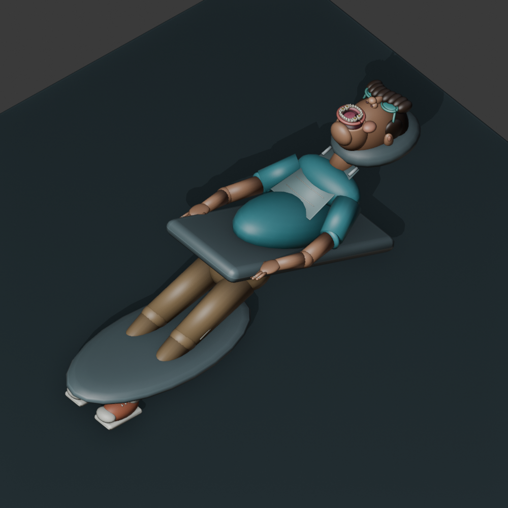

# Little Smiles

[](https://github.com/aranlucas/cavity-game/actions/workflows/checks.yml)


**A cozy clinic, three little patients, and one very shiny smile at a time.**

Little Smiles is a gentle single-player dental-care game. Walk around a 3D clinic, greet a patient, and finish a playful appointment: inspect → clean → repair → fill → cure. Care for three fictional patients each day, keep them comfortable, and earn their smile-club stickers.



_This is an asset preview from the project's Blender models, not a gameplay screenshot._

## Run

```bash
npm install
npm install -g portless@0.15.7
npm run dev
```

Open the local URL printed by Portless (normally https://cavity-game.localhost). The appointment game works without a backend, account, or room code. It saves progress and the sound setting in this browser's local storage every second and when leaving the page. Returning starts in the room with the current visit ready to resume. If storage is unavailable, the menu reports that saving is unavailable.

### Development URL with Portless

The normal `npm run dev` command uses
[Portless](https://github.com/vercel-labs/portless/tree/v0.15.7) for a stable local URL.
Install its CLI once with **Node.js 24 or newer** (within this project's supported
range), then run:

```sh
npm install -g portless@0.15.7
npm run dev
```

Open **https://cavity-game.localhost** with the default proxy settings.
Portless starts its shared proxy automatically. Its first HTTPS run creates and
trusts a local certificate authority and may prompt for administrator privileges
to bind port 443 or update local hostname entries. Start it from an interactive
terminal and review those prompts. `portless doctor` diagnoses local setup issues.

Portless supplies Vite with a free port, a loopback host, and `--strictPort`.
It starts Vite with the existing Cloudflare plugin directly, since `cf dev`
does not forward arbitrary Vite CLI flags.
The root command runs inside the `client` workspace.

Linked Git worktrees receive a branch-name prefix, such as
`https://fix-ui.cavity-game.localhost`; use the URL Portless prints.

Browser storage and offline caches belong to each origin. Existing data at a
numbered localhost URL stays there; use the app's export/import flow when available
to move data to the named URL.

## Play

- **WASD / arrow keys** move around the clinic. Drag to look around. On touch screens, use the movement pad and drag the scene.
- Approach the patient chair and press **E** or choose **Begin treatment**. The camera moves into a close-up of the patient's mouth in the same room.
- Select instruments with **1–5** or the compact tool belt. Aim and hold on a marked tooth; numbered targets also support Tab and Space/Enter.
- Repair in short bursts. The bur builds heat and locks temporarily if it overheats. Release to cool, or reassure the patient to restore comfort.
- **Q / Room** returns to the clinic. **Escape / Menu** pauses, opens controls, and offers sound, fullscreen, restart-visit, and new-day controls. Switching away from the page pauses automatically.
- Finish all five stages to earn care points and a patient-specific sticker. Complete Mia, Leo, and Ava's visits to finish a clinic day. Start a new day to play again; collected stickers stay in your album.

Treatment changes the modeled tooth surfaces: plaque and decay inserts shrink away, exposing prepared recesses, and fillings grow into those recesses before curing. The compact HUD tracks the current stage, tooth progress, comfort, instrument heat, and care points. Treatment and room navigation share one 3D scene.

## Real assets and boundaries

The patient and treatment mouth are original stylized models authored in Blender. Their anatomy and treatment sequence are fictional and simplified; the game does not simulate clinical dentistry or freeform volumetric tooth removal. A separate **adult upper-arch teaching cast**, sourced from Michael D. Scherer through NIH 3D (CC0), is displayed on a cabinet in the room. See [asset provenance](assets/ATTRIBUTION.md).

Editable Blender files and export scripts are included:

| Asset                                      | Blender source                  | Builder                                                                             |
| ------------------------------------------ | ------------------------------- | ----------------------------------------------------------------------------------- |
| Patient and treatment mouth                | `assets/patient-studio.blend`   | `scripts/build-patient.py`                                                          |
| Dental delivery equipment                  | `assets/clinic-equipment.blend` | `scripts/build-equipment.py`                                                        |
| Teaching cast, five instruments, and chair | `assets/dental-studio.blend`    | `scripts/process-scan.py`, `scripts/build-instruments.py`, `scripts/build-chair.py` |

The shipped patient, mouth, and equipment GLBs total about **600 KB**. They use Meshopt compression with the loader's bundled decoder. Current byte counts and validation results are recorded in `assets/asset-validation.json`. The separate teaching cast is 555,668 bytes, reduced from its 34 MB source scan.

To rebuild the patient, mouth, and equipment on macOS with Blender installed:

```bash
/Applications/Blender.app/Contents/MacOS/Blender --background --factory-startup --threads 2 --python scripts/build-patient.py
/Applications/Blender.app/Contents/MacOS/Blender --background --factory-startup --threads 2 --python scripts/build-equipment.py
sh scripts/optimize-models.sh
```

Use your Blender executable path on other systems. The builders save native `.blend` sources and preview renders under `assets/`, and self-contained GLBs in `client/public/models`. The optimization script preserves named gameplay nodes, materials, and repair-insert pivots. The earlier teaching-cast pipeline and gumline refinements are documented in [asset provenance](assets/ATTRIBUTION.md).

Both builders accept arguments after `--`: use `--output-dir /path/to/models` to export GLBs elsewhere and `--skip-preview` to skip rendering. Their editable `.blend` sources still save under `assets/`.

## Code and checks

- `client/src/App.tsx`: compact game HUD, menus, appointment lifecycle, and input gating.
- `client/src/appointment/Clinic.tsx`: furnished 3D clinic, patient, camera, and walking controls.
- `client/src/appointment/navigation.ts`: collision and movement rules.
- `client/src/appointment/rules.ts`: deterministic treatment, heat, comfort, and progression rules.
- `client/src/appointment/save.ts`: validated local saves and browser-storage failure handling.
- `client/src/appointment/surface.ts`: plaque, decay, and filling visibility and treatment progression.
- `client/src/appointment/Scene.tsx`: GLB loading, scene lighting, instrument positioning, and treatment targets.
- `client/src/appointment/useClinicSound.ts`: optional locally synthesized instrument sounds and completion chimes.
- `tests/*.test.mjs`: gameplay, clinic-day progression, save, navigation, tooth-surface, and GLB regressions (Node 24, no test framework required).

```bash
npm test
npx tsc -p client/tsconfig.json --noEmit
npm run build  # Typecheck, Cloudflare Vite build, and cf deployment dry run
npm run lint
```

GitHub Actions runs the tests, build, and lint checks on pushes and pull requests.

`npm run build` typechecks the client, builds it with the Cloudflare Vite plugin, and validates an assets-only deployment through `cf deploy --dry-run`. It uploads nothing and needs no Cloudflare credentials. The root scripts run `cf` inside the `client` workspace, where `client/vite.config.ts` configures the build and `client/cloudflare.config.ts` defines the `cavity-rush` Worker and single-page application fallback. Generated deployment output and types live under `client/.cloudflare/` and are ignored by Git.

`npm run deploy` runs the same typecheck and build, then publishes the static assets through the [Cloudflare CLI (`cf`)](https://developers.cloudflare.com/cf/projects/). Authenticate with `npm exec -w client -- cf auth login` first, or set `CLOUDFLARE_API_TOKEN` and `CLOUDFLARE_ACCOUNT_ID` in CI. The config retains the `GameRoom` deletion declaration for the former multiplayer namespace. There is no Cloudflare Worker script and no `/ws` Durable Object. The appointment game does not need a backend to play locally.

The current Cloudflare Vite beta runs `docker image ls` to clean up previous container build images even when the project has no containers. If Docker is installed but its daemon is stopped, that cleanup can print a Docker connection error; the plugin catches the failure and the assets-only build continues. Docker is not required for this project.
